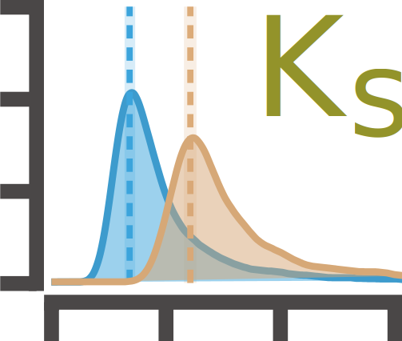
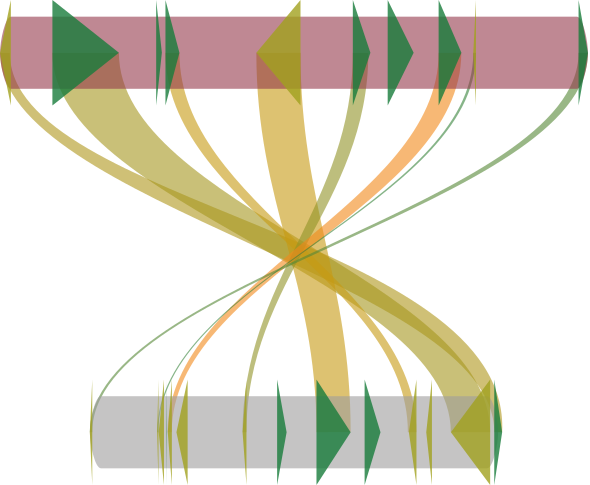
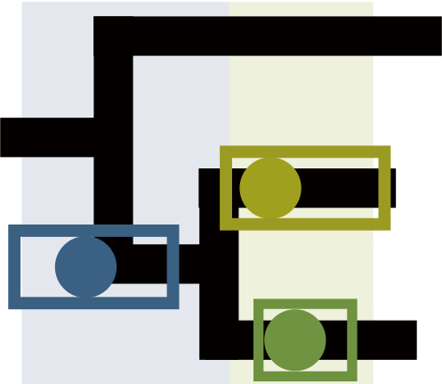
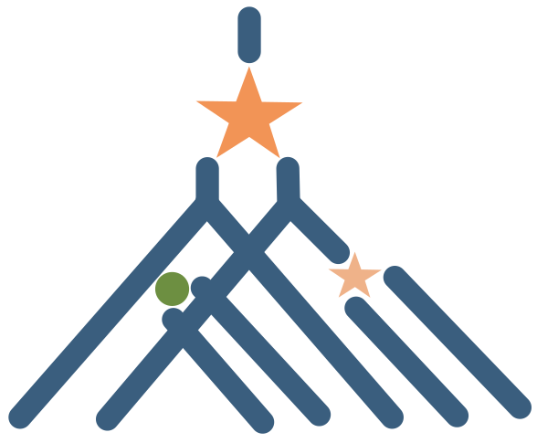

# shinyWGD 

<!-- badges: start -->


[](https://github.com/li081766/shinyWGD/issues)
[](https://bioinformatics.psb.ugent.be/shiny/ShinyWGD/)
<!-- badges: end -->

### Overview

`shinyWGD` can prepare the input and command lines for [`wgd`](https://github.com/arzwa/wgd), [`ksrates`](https://github.com/VIB-PSB/ksrates), [`i-ADHoRe`](https://github.com/VIB-PSB/i-ADHoRe), and [`OrthoFinder`](https://github.com/davidemms/OrthoFinder). 

`shinyWGD` can also assist users in using [`Whale`](https://github.com/arzwa/whaleprep/tree/master) to infer reconciled gene trees and parameters of a model of gene family evolution given a known species tree.

After directly uploading the output of `wgd`, `ksrates`, `i-ADHoRe`, or `OrthoFinder`, `shinyWGD` can study the whole genome duplication events (WGDs).

### Installation

* Install the latest development version from GitHub (requires [devtools](https://github.com/r-lib/devtools) package):

```r
if (!require("devtools")) {
  install.packages("devtools")
}
devtools::install_github("li081766/shinyWGD", dependencies = TRUE, build_vignettes = TRUE)
```

To ensure the successfully loading of `Gallery` and `Help` pages in `shinyWGD`, please set `build_vignettes` to `TRUE` when installing the package.

### Usage

Please refer to the [`shinyWGD` server](https://bioinformatics.psb.ugent.be/shiny/ShinyWGD/) or the vignettes of `shinyWGD` to see the detailed usage. 

```r
library(shinyWGD)
runshinyWGD()
help(package="shinyWGD")
```

### The structure of `shinyWGD`

- #####  Home
- #####  Scripts
  -  Data Preparation
  -  Codes
- #####  Analysis
  -  Age Distribution Analysis
  -  Synteny Analysis
  -  Tree Building
  -  Gene Tree – Species Tree Reconciliation Analysis
- #####  Help

[Usage](https://li081766.github.io/shinyWGD_Demo_Data/intro_to_shinywgd.html)

[Gallery](https://li081766.github.io/shinyWGD_Demo_Data/gallery.html)


### Dependencies

- ##### External software
  - [`wgd`](https://github.com/arzwa/wgd)
  - [`ksrates`](https://github.com/VIB-PSB/ksrates)
  - [`i-ADHoRe`](https://github.com/VIB-PSB/i-ADHoRe)
  - [`Whale`](https://github.com/arzwa/Whale.jl/tree/master)
  - [`OrthoFinder`](https://github.com/davidemms/OrthoFinder)
  - [`diamond`](https://github.com/bbuchfink/diamond)
  - [`MAFFT`](https://mafft.cbrc.jp/alignment/software/)
  - [`trimAl`](https://trimal.cgenomics.org/)
  - [`PAML`](http://abacus.gene.ucl.ac.uk/software/paml.html)
  - [`MrBayes`](https://nbisweden.github.io/MrBayes/)
  - [`ALE`](https://github.com/ssolo/ALE)

- ##### R packages
  - `{shiny}`
  - `{shinyjs}`
  - `{shinyFiles}`
  - `{shinyBS}`
  - `{shinyWidgets}`
  - `{shinyalert}`
  - `{bslib}`
  - `{bsplus}`
  - `{htmltools}`
  - `{tidyverse}`
  - `{vroom}`
  - `{english}`
  - `{data.table}`
  - `{argparse}`
  - `{dplyr}`
  - `{tools}`
  - `{seqinr}`
  - `{DT}`
  - `{stringr}`
  - `{fs}`
  - `{tidyr}`
  - `{ape}`
  - `{ks}`
  - `{mclust}`
