<link rel="stylesheet" href="https://cdnjs.cloudflare.com/ajax/libs/font-awesome/6.0.0-beta3/css/all.min.css">

 
#### This page gives users the figure examples generated by ShinyWGD

<!-- Content with the floating layout     border-right: 1px solid #A9A9A9;     background-color: #F9F9F9;
 -->
<!-- div style="position: fixed; top: 50%; left: 120px; transform: translate(0, -50%); background-color: #F9F9F9; color: #4C4C4C; padding: 10px 20px; border-radius: 8px; cursor: pointer; border: 2px solid #A9A9A9;" -->

##### Index:
- [<i>K</i>s Age Distribution](#ks-plot)
  - [Paralog <i>K</i>s age distribution](#paralog-ks)
    - [*Single spcies*](#paralog-ks-one-species)
    - [*Multiple species*](#paralog-ks-multiple-species)
  - [Ortholog <i>K</i>s age distribution](#ortholog-ks)
  - [Substitution rate correctiong](#rate-correction)
    - [*With paralogous species*](#rate-with-paralog)
    - [*Without paralogous species*](#rate-without-paralog)
- [Synteny Analysis](#synteny-analysis)
  - [Intra-comparing alignment](#intra-comparing)
    - [*Dot plot*](#intra-comparing-dot)
    - [*Parallel-line plot*](#intra-comparing-parallel)
    - [*Micro-synteny plot*](#intra-comparing-micro)
  - [Inter-comparing alignment](#inter-comparing)
    - [*Dot plot*](#inter-comparing-dot)
    - [*Parallel-line plot*](#inter-comparing-parallel)
    - [*Micro-synteny plot*](#inter-comparing-micro)
  - [Multiple-species alignment](#multiple-species-alignment)
  - [Clustering analysis](#clustering-analysis)
    - [*Clustering plot*](#clustering-plot)
    - [*PAR zoom-in plot*](#PAR-zoom-in)
- [Tree Building](#tree-building)
  - [<i>K</i>s unit tree plot](#ks-tree)
  - [TimeTree plot](#time-tree)
  - [<i>K</i>s unit tree and TimeTree joint tree plot](#joint-tree)
- [Gene Tree – Species Tree Reconciliation](#tree-reconciliation)

  
  #### <i>K</i>s Age Distribution
  ---
  
  ##### Paralog <i>K</i>s age distribution

  
  ###### *Single species*
  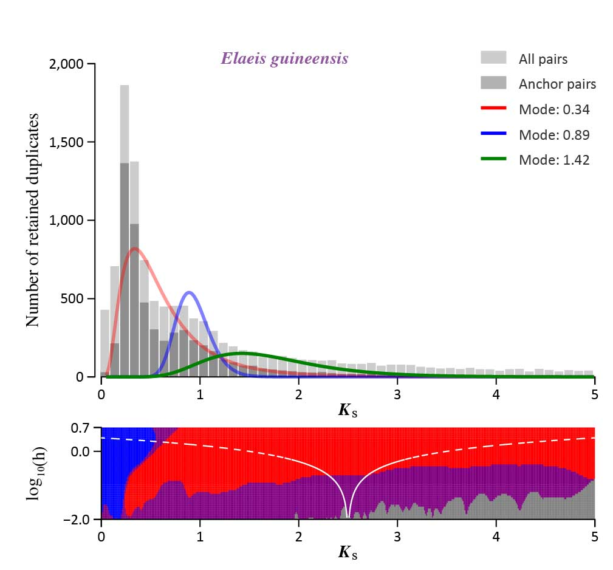

  
  ###### *Multiple species*
  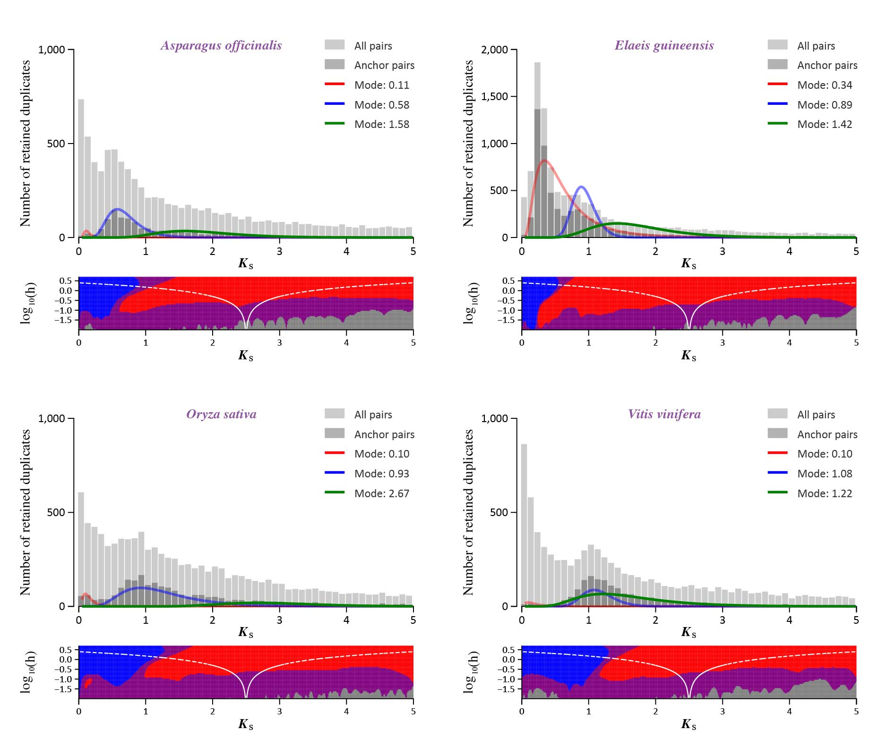

  ---
  
  ##### Ortholog <i>K</i>s age distribution
  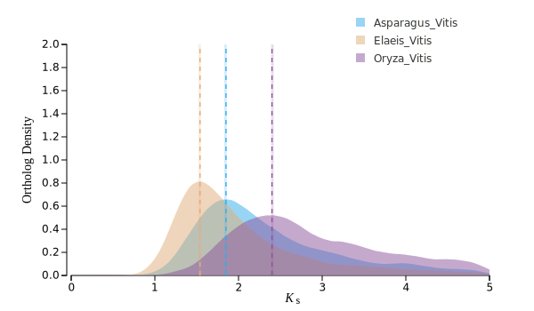

  ---
  
  ##### Raletive rate correctiong

  
  ###### *With paralogous species*
  

  
  ###### *Without paralogous species*
  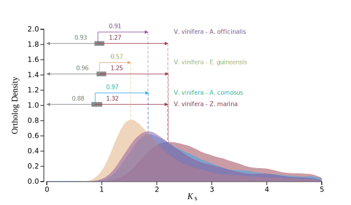

  ---
  
  #### Synteny Aanlysis
  ---
  
  ##### Intra-comparing alignment
  
  ###### *Dot plot*
  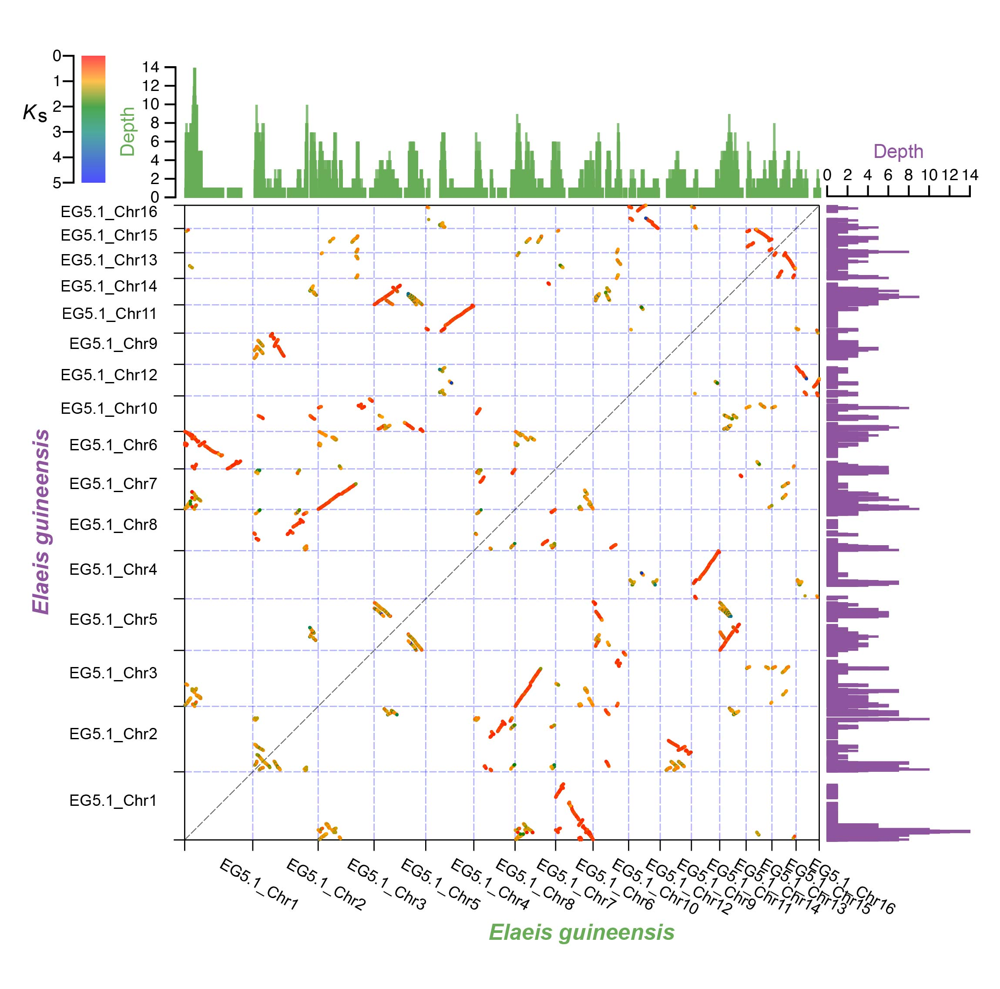

  
  ###### *Parallel-line plot*
  

  
  ###### *Micro-synteny plot*
  

  ---
  
  ##### Inter-comparing alignment

  
  ###### *Dot plot*
  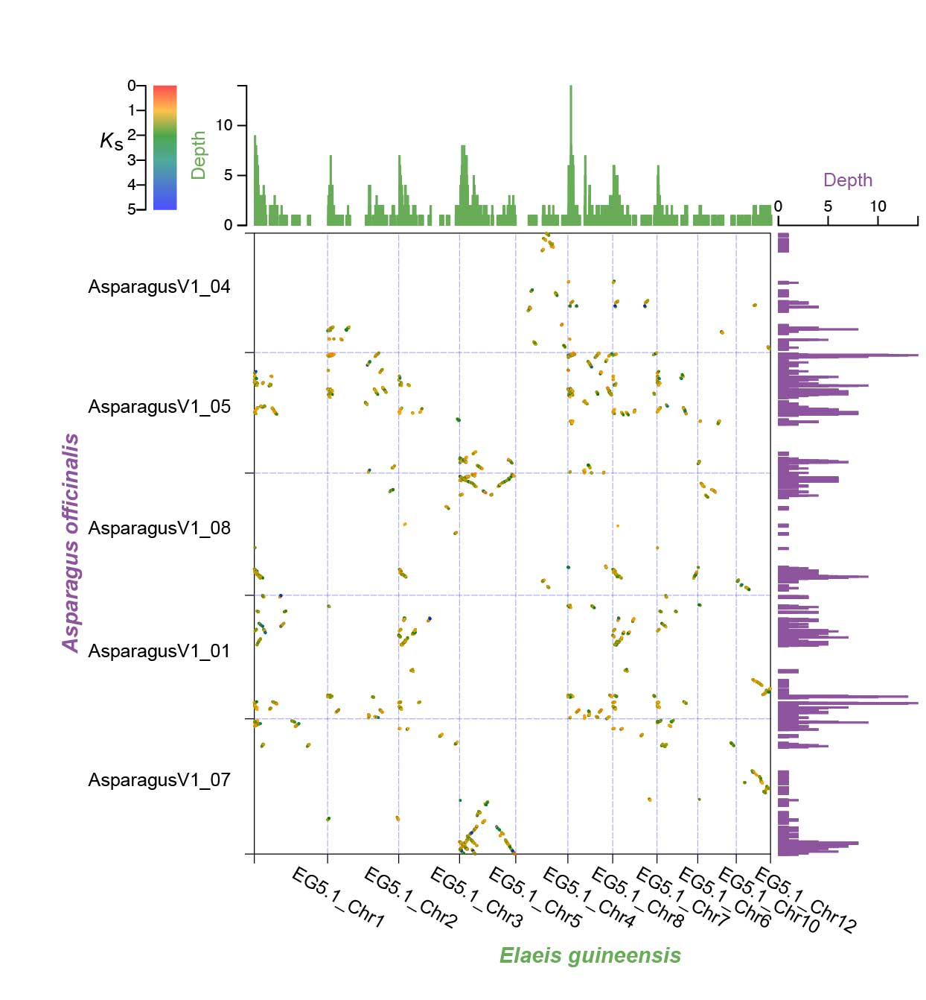

  
  ###### *Parallel-line plot*
  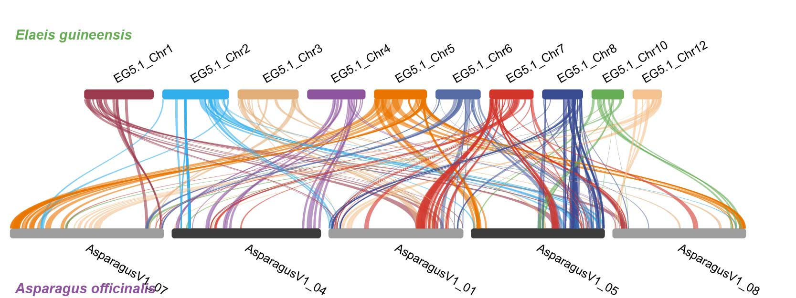

  
  ###### *Micro-synteny plot*
  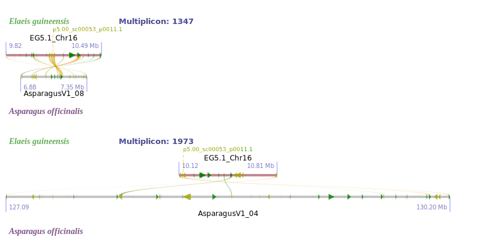

  ---
  
  ##### Multiple-species alignment
  
  
  ---
  
  ##### Clustering analysis

  
  ###### *Clustering plot*
  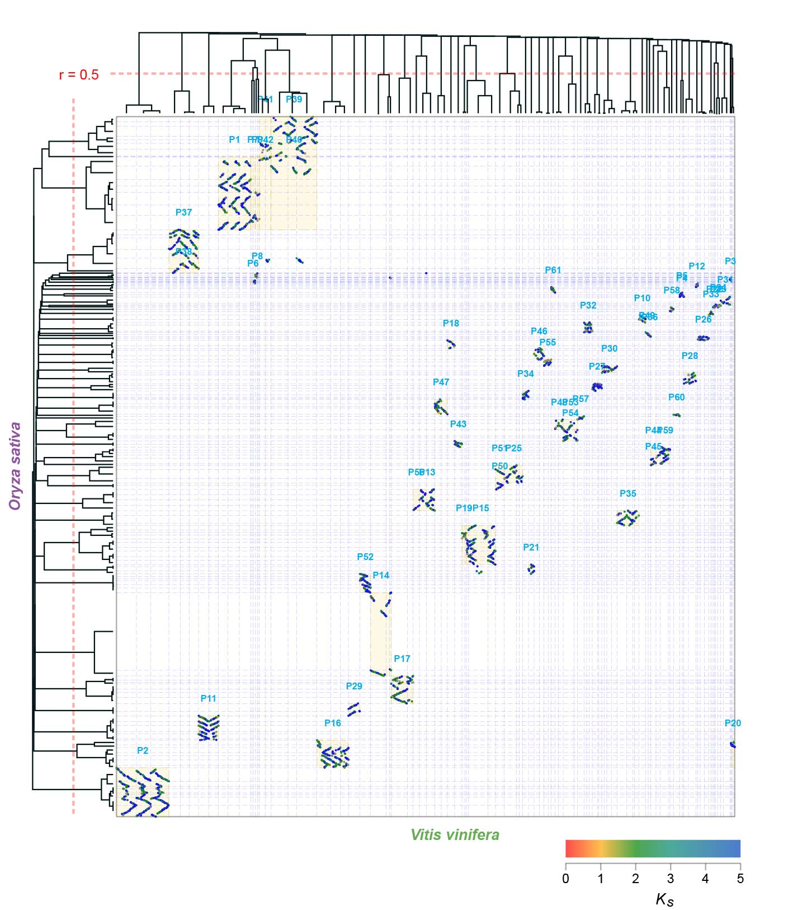

  
  ###### *PAR zoom-in plot*
  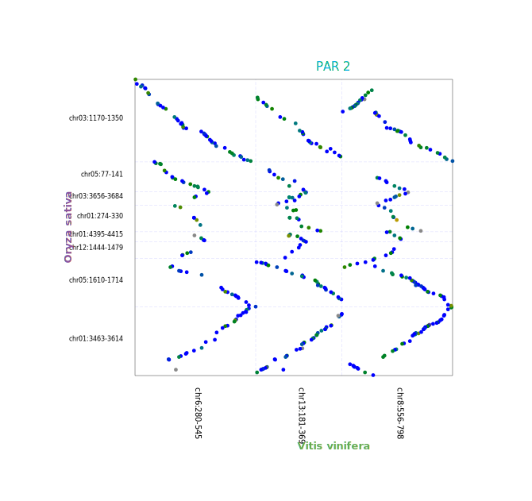

  ---
  
  #### Tree Building

  
  ##### <i>K</i>s unit tree plot
  

  
  ##### TimeTree plot
  

  
  ##### <i>K</i>s unit tree and TimeTree joint tree plot
  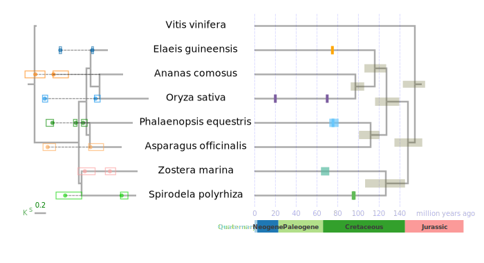

  ---
  
  #### Gene Tree – Species Tree Reconciliation
  

