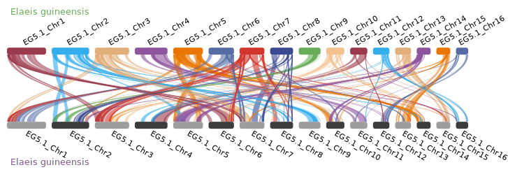
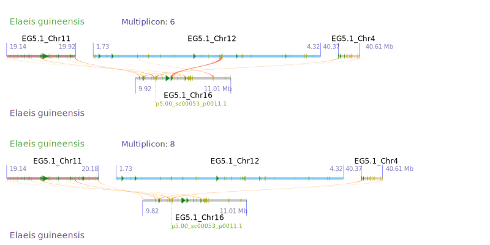

### ShinyWGD

<!-- Content with the floating layout -->

<!-- div style="position: fixed; top: 40%; left: 10px; bottom: 0; transform: translate(0, -50%); background-color: #F9F9F9; color: #4C4C4C; padding: 5px 5px;" -->

##### Index

- [Introduction](#introduction)
- [Usage](#usage)
  - [<i aria-label="microscope icon" class="fa fa-microscope fa-fw fa-fade" role="presentation"></i> Data Preparation](#data-preparation)
    - [Preparing the input data](#preparing)
      - [*Option One*](#option-one)
      - [*Option Two*](#option-two)
    - [Excuting `wgd`, `krates`, and `orthofinder`](#excuting)
    - [Extracting the tree from Timetree.org](#extracting)
  - [<i class="fas fa-chart-line" role="presentation"></i> <i>K</i>s Age Distribution Analysis](#ks-inference)
    - [Paralog <i>K</i>s age distribution](#paralog-ks)
    - [Ortholog <i>K</i>s age distribution](#ortholog-ks)
    - [Substitution rate correctiong](#rate-correction)
  - [<i aria-label="water icon" class="fa-solid fa-water" role="presentation"></i> Synteny Analysis](#synteny-analysis)
    - [Intra- or Inter-species alignment](#intra-inter-comparing)
    - [Multiplicon-level synteny](#multiplicon-level-synteny)
    - [Multiple species alignment](#multiple-species-alignment)
    - [Clustering analysis](#clustering-analysis)
  - [ Tree Building](#tree-building)
    - [<i>K</i>s unit tree](#ks-tree)
    - [TimeTree](#time-tree)
    - [<i>K</i>s unit tree and TimeTree joint tree](#joint-tree)
  - [ Gene Tree – Species Tree Reconciliation Analysis](#reconciliation-analysis)

  ---

  
  ### Introduction

  ShinyWGD
   can prepare the input and command lines for [`wgd`](https://github.com/arzwa/wgd), [`ksrates`](https://github.com/VIB-PSB/ksrates), [`i-ADHoRe`](https://www.vandepeerlab.org/?q=tools/i-adhore30), and [`OrthoFinder`](https://github.com/davidemms/OrthoFinder)
  (<i aria-label="microscope icon" class="fa fa-microscope fa-fw fa-fade" role="presentation"></i> Data Preparation). 

  ShinyWGD can also assist users to use [`Whale`](https://github.com/arzwa/whaleprep/tree/master) to infer reconciled gene trees and parameters of a model of gene family evolution given a known species tree.

  After directly uploading the output of `wgd`, `ksrates`, `i-ADHoRe`, or `OrthoFinder`, ShinyWGD can study the whole genome duplication events (WGDs).

  This document will provide an example to demonstrate the usage of
  ShinyWGD.

  ---

  

  ### Usage

  ---

  

  #### <i aria-label="microscope icon" class="fa fa-microscope fa-fw fa-fade" role="presentation"></i> Data Preparation

  

  ##### Preparing the input for `wgd`, `ksrates`, `i-ADHoRe` or `OrthoFinder`

  Please select the proper number of species you want to study in Select Number of Species to Analyze: first.

  <blockquote>

  <i aria-label="warning icon" class="fa fa-warning fa-fw" role="presentation"></i> If only one species is provided, the core program will be set to <b>wgd</b>, otherwise, <b>ksrates</b> will be chosen.
</blockquote>

   ShinyWGD
   provides two options to upload the data in <i aria-label="microscope icon" class="fa fa-microscope fa-fw" role="presentation"></i> Data Preparation Page.

  

  ###### *Option One*

   Users can prepare a **Tab-Separated** file in which each row includes the data of a species. 

  This option is suitable to study multiple species. 

  The detailed format of this file is below:  

  + **`Tab-Separated file`**
    <table>
      <tr>
        <th><i>latin name</i></th>
        <th style="padding-left: 50px;">cds patha</th>
        <th style="padding-left: 40px;">gff pathb (optional)</th>
      </tr>
      <tr>
        <td><i>Elaeis guineensis</i></td>
        <td style="padding-left: 50px;">PATH/elaeis.fasta</td>
        <td style="padding-left: 40px;">PATH/elaeis.gff</td>
      </tr>
      <tr>
        <td><i>Oryza sativa</i></td>
        <td style="padding-left: 50px;">PATH/aryza.fasta</td>
        <td style="padding-left: 40px;">PATH/oryza.gff3</td>
      </tr>
      <tr>
        <td><i>Asparagus officinalis</i></td>
        <td style="padding-left: 50px;">PATH/asparagus.fasta</td>
        <td style="padding-left: 40px;"></td>
      </tr>
    </table>

    - **a** `cds` is the coding region of a gene or the portion of a gene's DNA or RNA that codes for protein. This file can be `fasta` or `gzipped-fasta`.  This column is **mandatory**.
    - <i aria-label="warning icon" class="fa fa-warning fa-fw" role="presentation"></i> Do not contain the [alternative isoforms](https://en.wikipedia.org/wiki/Alternative_splicing) of each gene.
    - **b** `gff` is the format consists of one line per feature, each containing nine columns of data, plus optional track definition lines, see more [click here](https://www.ensembl.org/info/website/upload/gff.html).  The file can be `gff`, `gff3`, `gzipped-gff`, or `gzipped-gff3`.  This column is **mandatory** for **`focal species`** and is **optional** for **`other species`**. 

    - **`focal species`** is the parameter in `ksrates`, which will be set in the [`configure file`](https://ksrates.readthedocs.io/en/latest/configuration.html) of `ksrates`.

  After successfully uploading the tab-separated file, the number of species in the file will be calculated. 
  + If only one species needed to be studied, ShinyWGD
   will generate the command line for `wgd`  by clicking the <i aria-label="code icon" class="fa fa-code fa-fw" role="presentation"></i> Create WGD Codes or <i aria-label="code icon" class="fa fa-code fa-fw" role="presentation"></i> Create i-ADHoRe Codes button in the right **`Setting`** panel. 
    + Users can check the codes by clicking the <i aria-label="share icon" class="fa fa-share" role="presentation"></i> Check WGD Codes or <i aria-label="share icon" class="fa fa-share" role="presentation"></i> Check i-ADHoRe Codes button.
    + Then, users can click the <i arial-label="download icon" class="fa fa-download" role="presentation"></i> Download Analysis Data button to download the prepared files and script for `wgd` program. 
     
  + If multiple species needed to be study, ShinyWGD
   will generate the command line for `ksrates`. 
    + Two more parameters should be added.
      + [`focal species`](https://ksrates.readthedocs.io/en/latest/configuration.html) set the focal species for `ksrates`.
      + `newick tree` upload a tree file in `newick` format. The tree should contain all the species.
    + Then, users can click the <i aria-label="code icon" class="fa fa-code fa-fw" role="presentation"></i> Create Ksrates Codes button to generate the `configure file` and command line for `ksrates`.
    + After that, users can click the <i aria-label="share icon" class="fa fa-share" role="presentation"></i> Check Ksrates Codes button to review the `configure file` and command line for `ksrates`.
    + Then, users can click the rest buttons to generate the codes for `i-ADHoRe` and `OrthoFinder`.
    + Finally, users can click the <i arial-label="download icon" class="fa fa-download" role="presentation"></i> Download Analysis Data button to download the prepared files and script for `ksrates`, `i-ADHoRe`, and `OrthoFinder` program. 

    <!--  --->
       

  

  ###### *Option Two*

   This option provide users a more straightforward way to upload data. 

  + After selecting the number of studied species, the corresponding uploading panels will be created. 
  + Three items (`latin name`, `cds fasta`, and annotation `gff`) of each species should be set or uploaded by users. 
  + Once more than one species needed to be analyzed, the `focal species` and `newick tree` should be defined by users.
  + Then users can click the <i aria-label="code icon" class="fa fa-code fa-fw" role="presentation"></i> Create WGD Codes or <i aria-label="code icon" class="fa fa-code fa-fw" role="presentation"></i> Create Ksrates Codes button to create the codes for `wgd` or `ksrates` according to the species number.
  + After reviewing and downloading the necessary files, users can execute `wgd`, `ksrates`, `i-ADHoRe` or `OrthoFinder` in their local environment. 
   

  

  ##### Executing `wgd`, `krates`, `i-ADHoRe` or `OrthoFinder`
  After decompressing the downloaded compressed file (**`Analysis_Date.tgz`**), users will find the `bash` and `configure` files (`run_wgd.sh` / `run_ksrates.sh`, `run_iadhore.sh`, `run_orthofinder.sh`).  Users can execute them in their local environment.  
    <!-- + downloading files for `wgd`
      
    + downloading files for `ksrates` and `i-ADHoRe`
       --->
    - How to install `wgd` to your local environment, please read the [`wgd` document](https://github.com/arzwa/wgd).
    - How to install `ksrate` to your local environment, please read the [`ksrates` document](https://ksrates.readthedocs.io/en/latest/installation.html).
    - How to install `i-ADHoRe` to your local environment, please read the [`i-ADHoRe` document](https://www.vandepeerlab.org/?q=tools/i-adhore30).
    - How to install `OrthoFinder` to your local environment, please read the [`OrthoFinder` document](https://github.com/davidemms/OrthoFinder).
    <blockquote>

  <i aria-label="warning icon" class="fa fa-warning fa-fw" role="presentation"></i> When creating the Code and files for i-ADHoRe, the alignment file will be produced. The alignment process will use the diamond program. So please install diamond program first.</blockquote>

   

  

  ##### Extracting the tree from TimeTree.org

  If users don’t ensure the evolutionary relationships among the studied species,  ShinyWGD
   provides an alternative way to generate the newick tree through interacting with [TimeTree.org](http://www.timetree.org/) database.

  <blockquote>

  <i aria-label="warning icon" class="fa fa-warning fa-fw" role="presentation"></i> TimeTree database does not include all the species.
   &nbsp;&nbsp;&nbsp;&nbsp;&nbsp;&nbsp;If the species are not included in the TimeTree database, you should ensure the relationship in other ways.
</blockquote>

  Please click the <i aria-label="tree icon" class="fa fa-tree fa-fw" role="presentation"></i> Extract Tree button to extract a tree from TimTree.org database. 
  After successfully obtaining the tree, users can review the tree in the box below <i aria-label="tree icon" class="fa fa-tree fa-fw" role="presentation"></i> Extract Tree button. 
    
  Users need to save this tree to a local file and then upload the file to `newick tree` panel in the <b>`Setting`</b> block.

  ---

  

  #### <i>K</i>s Age Distribution Analysis

  After successfully running the corresponding shell files locally, the necessary outputs will be saved in the **`Analysis_Date`** folder. Then users can choose this folder in the `Uploading` panel in <i class="fas fa-chart-line" role="presentation"></i> <i>K</i>s Age Distribution Analysis page.

  <!--  --->

  <blockquote>

  <i aria-label="warning icon" class="fa fa-warning fa-fw" role="presentation"></i> Users should choose the folder which is originated from the folder created by ShinyWGD program to avoid the failure of displaying the correct file names.
</blockquote>

    
  
  ##### Paralog <i>K</i>s age distribution
  Once selecting one / multiple species from the drop-down menu of  <i class="fas fa-list" role="presentation"></i> Paralog <i>K</i>s &#x25BC; , users can click the <i class="fa-solid fa-gear"></i> Configure <b><i>K</i>s</b> Analysis to create the output panel in the right side of the page. 

  After clicking the <i class="fa-solid fa-play"></i> Start <b><i>K</i>s</b> Analysis, the <i>K</i>s age distribution of the selected species will be generated. 

  ShinyWGD employs two methods to model the potential peaks of the distribution. 

  First, ShinyWGD fits normal mixture models to the <b><i>K</i>s</b> data using maximum likelihood with EMMIX. ShinyWGD will test one to ten components with 500 random starts. Fitted models are selected by the Bayesian Information Criterion (BIC) within EMMIX. Finally, the fitted models are drawn above the bar plot of each species.

  Second, ShinyWGD uses SiZer to identify significant peaks based on the significant zero crossings of derivatives from kernel density estimation. Then, a subplot to show the output of SiZer will be added under the bar plot.

  <blockquote>

  Please refer to the papers below to see details about EMMIX and SiZer.

  McLachlan G, Peel D. 1999. The EMMIX algorithm for the fitting of normal and t-components. <i>J Stat Softw Artic</i>. 4:1–14.

  Barker MS, et al. . 2008. Multiple paleopolyploidizations during the evolution of the Compositae reveal parallel patterns of duplicate gene retention after millions of years. <i>Mol Biol Evol</i>. 25(11):2445–2455.

  Chaudhuri P, Marron JS. 1999. SiZer for exploration of structures in curves. <i>J Am Stat Assoc</i>. 94(447):807–823.
  
</blockquote>

  The example output is below.

  

    
  
  ##### Ortholog <i>K</i>s age distribution
  Users need to select one species from the Group A of the <i class="fas fa-list" role="presentation"></i> Ortholog <i>K</i>s &#x25BC; as the focal species. Then users can choose multiple species from the Group B to compute the density of <i>K</i>s age distribution between the focal species and the species in the Group B. 

  To obtain the potential peak of the plot, ShinyWGD will fit the peak by using the Epanechnikov kernel funciton. Then 95% confidence interval (CI) is estimated by 1000 iterations.

  The example output is below.

  

  In the above figure, the dash line is the peak of a combination of focal species and another species. The colored rectangle is the 95% CI. Users can retrieve the detail information about the density, the peaks, and the 95% CIs by hovering the mouse above the lines or rectangles.  

  
  ##### Substitution rate correction
  When comparing the one-to-one ortholog <i>K</i>s distributions between studied species and the reference species, the different <i>K</i>s peaks for the same speciation event may exist, suggesting different synonymous substitution rates among the studied species, resulting in an over- or under-estimate for the divergence between the studied species and the reference species. 

  To quantify the difference in substitution rates, ShinyWGD employs the relative rate tests. First, the Newick tree, which contains the phylogenetic relationship, will be used to ensure enough species. Then, users need to define a <b> reference species</b> and an <b>outgroup species</b> to determine a tree structure among the species which will be used in the relative rate test. Then, the <i>K</i>s distance between two species is estimated by the mode of their ortholog KS distribution. Then, using the <i>K</i>s distance between the reference species and the studied species, the <i>K</i>s distance between the outgroup species and the reference species, the <i>K</i>s distance between the outgroup species and the studied species, the distances to the studied species and the reference species after their divergence are computed. Finally, ortholog <i>K</i>s between the studied species and the reference species is corrected by the double of the <i>K</i>s distance to the reference species, assuming that studied species has the same substitution rate as the reference species. 

  The example output is below.

  

  In the above figure, Kernel-density estimates (KDEs) of <i>K</i>s distribution for one-to-one orthologues between <i>V. vinifera</i> and other four species, namely <i>A. officinalis</i>, <i>E. guineesis</i>, <i>A. comosus</i>, and <i>Z. marina</i>. The bar and line plots are the paralog<i>K</i>s distributions of <i>E. guineensis</i>. As the modes (peaks) of the KDE all represent the distances between <i>V. vinifera</i> and the compared species, the differences observed among the <i>K</i>s values of the modes indicate substitution rate variations among the studied species. The segments with arrows above the KDE denote, from bottom to top, the <i>K</i>s distances computed for <i>A. comosus</i> (dark red), <i>E. guineensis</i> (yellow), and <i>A. officinalis</i> (blue) using <i>Z. marina</i> (purple) as the reference and <i>V. vinifera</i> as the outgroup. The dotted lines align with the observed modes in the KDE of the ortholog <i>K</i>s distributions. The black dots on the segments represent the divergence between <i>Z. marina</i> with the other three species; hence, the lengths of segments pointed to the right show the <i>K</i>s accumulated in <i>A. comosus</i>, <i>E. guineensis</i> and <i>A. officinalis</i>, whereas the grey segments pointed to the left show the <i>K</i>s  distance between <i>V. vinifera</i> and the divergence of the other species. The grey rectangles show the 95% confidence intervals of the <i>K</i>s inferred from 200 bootstraps.

  ---

  
  #### Synteny Analysis

  
  ##### Intra- or Inter-species alignment

  After uploading the folder of `i-ADHoRe` in this page, users can study the *intra-*, *inter-*, and *multiple-* species synteny, as well as the *clustering analysis*.

  After selecting the studied species, users can click the <i class="fa-solid fa-gear"></i> Configure Analysis to create the output panel in the right side of the page. 

  <!--  --->

  Users can set the threshold for the number of anchor pairs in each multiplicon to filter out the small multiplicons which contain less anchor pairs. 

  The dot plot and parallel link plot will be generated.

  
  

  
  ##### Multiplicon-level synteny

  Users can also search a certain gene to check the location of the gene in the multiplicon in the Multiplicon-level Synteny panel and then plot the searched multiplicon.

  

  
  ##### Multiple species alignment

  In the multiple species alignment panel, users can define the order of species in the plot. Users can change the color of species by clicking the text of the species name. When the mouse hovers a link, the related links with this link among species can be highlighted using different colors.

  The example output is below.

  

  
  ##### Clustering analysis

  ShinyWGD employs the Hierarchical clustering method for constructing putative ancestral regions (PARs). The segments are identified from the outputs of `i-ADHoRe`, and the **homolog concentration scores** are calculated using `-log(p)`, where `p` is the probability of the observed number of homolog pairs as modeled by a Poisson distribution.

  <blockquote>

  <i aria-label="fa-info icon" class="fa fa-info fa-fw" role="presentation"></i> To read more about <b><i>homolog concentration scores</i></b>, please refer to <i>Putnam NH, et al. (2008) The amphioxus genome and the evolution of the chordate karyotype. Nature 453:1064–1071</i>.
</blockquote> 
  
  For each segment, the array of scores against all segments in the other genome forms a unique profile. The segments are then clustered based on the similarity of these profiles (determined by **Pearson correlation coefficient r**) using the average linkage method. The default cutoff of r is 0.3. Users can change this cutoff through the sliding block. The faint yellow rectangle will highlight the significantly enriched regions (`P < 1E-10`). Then, users can zoom in each PAR through the <b>Putative Ancestral Regions</b> block.

  The example output is below.

  

  In the example, we used 0.5 as the cutoff for **r** and 10 to filter out the segment with fewer anchor points. In total, we identified 61 PARs. 

  A single PAR zooms in is below.

  

  ---

  
  ####  Tree Building

  In this page, users can generate the <i>K</i>s unit tree, time tree, and a joint tree with <i>K</i>s unit tree and time tree.

  <!--  --->

  
  ##### <i>K</i>s unit tree

  ShinyWGD uses the single-copy gene families built by *OrthoFinder* to calculate the <i>K</i>s unit tree. Users can check the tree in the *Orthofinder_wd* folder, named *singleCopyGene.ds_tree.newick*. Once uploading the tree file in the <i>K</i>s Tree File panel, the <i>K</i>s unit tree will displayed in the right side of the page. Users can click the text of the species name to change the color or add a symbol to the species. Users can click the branch to add a <i>K</i>s peak into the branch.

  Users can upload a file which contains the <i>K</i>s peaks of each studied species to place these peaks into the <i>K</i>s unit tree.

  <!--
  + **<i>K</i>s Peaks file** separated by Tab
  |<i>latin name</i>      |      <i>K</i>s peak |        95% CI   | color    |
  |--------|:--------|:--------|:--------|
  |Elaeis_guineensis      |      0.25        |0.19-0.26  |  #79FF79|
  |Oryza_sativa           |      1.1         |1.02-1.3   |  #5CADAD|
  |Oryza_sativa           |      0.3         |0.22-0.4   |  #5CADAD|
  -->

  + **<i>K</i>s Peaks file** separated by Tab

    <table>
      <tr>
        <th><i>latin name</i></th>
        <th style="padding-left: 30px;"><i>K</i>s peak</th>
        <th style="padding-left: 40px;">95% CI</th>
        <th style="padding-left: 30px;">color</th>
      </tr>
      <tr>
        <td>Elaeis_guineensis</td>
        <td style="padding-left: 30px;">0.25</td>
        <td style="padding-left: 40px;">0.19-0.26</td>
        <td style="padding-left: 30px;">#79FF79</td>
      </tr>
      <tr>
        <td>Oryza_sativa</td>
        <td style="padding-left: 30px;">1.1</td>
        <td style="padding-left: 40px;">1.02-1.3</td>
        <td style="padding-left: 30px;">#5CADAD</td>
      </tr>
      <tr>
        <td>Oryza_sativa</td>
        <td style="padding-left: 30px;">0.3</td>
        <td style="padding-left: 40px;">0.22-0.4</td>
        <td style="padding-left: 30px;">#5CADAD</td>
      </tr>
    </table>

   

  The example output is below.

  

  
  ##### Time tree

  Users can upload a nexus tree withe the divergence time information. The format of the tree is the output file of *MCMCTree*, named *FigTree.tre*. Be careful with the time unit, please use the 100 million yeas as the time scale. Users can click the text of the species name to change the color or add a symbol to the species. Users can click the branch to add a WGD into the branch.

  Users can upload a file which contains the WGD events of each studied species to place these WGDs into the tree.

  + **WGD Events file** separated by Tab

    <table>
      <tr>
        <th><i>latin name</i></th>
        <th style="padding-left: 50px;">WGD eventsa</th>
        <th style="padding-left: 30px;">color</th>
      </tr>
      <tr>
        <td>Elaeis_guineensis</td>
        <td style="padding-left: 50px;">0.85,0.1-0.2</td>
        <td style="padding-left: 30px;">#79FF79</td>
      </tr>
      <tr>
        <td>Oryza_sativa</td>
        <td style="padding-left: 50px;">0.32,0.1-0.2,1.26-1.3</td>
        <td style="padding-left: 30px;">5CADAD</td>
    </table>

  - **a** WGD events can be a single time point or a time interval. Please use "**,**" to separate multiple WGD events within a species. 
   

  The example output is below.

  

  
  ##### <i>K</i>s unit tree and TimeTree joint tree
  If users upload both <i>K</i>s unit tree and the time tree, a joint <i>K</i>s unit tree and time tree will be generated.

  The example output is below.

  

  In the above figure, the left subplot is the <i>K</i>s unit tree. The right subplot is the time tree. Users can also add the <i>K</i>s peaks or WGD events into the tree when clicking the branch.

  ---

  
  ####  Gene Tree – Species Tree Reconciliation Analysis

  In this page, users can use `Whale` to operate the gene tree - species tree reconciliation analysis.

  Users need to upload two inputs to operate `Whale.jl`. One is the species time tree in `Newick` format. Another is the folder which includes all ALE files. If users use `OrthoFinder` in ShinyWGD, users can find the folder in `Orthofinder_wd`, named *all_tree_ALE_files*. Users can also follow the [instruction](https://github.com/arzwa/whaleprep/tree/master) of `Whale.jl` to prepare the ALE files by using the gene families built by other software.

  <!--  -->

  Once the tree file uploaded, users can check the topology of the tree in the right panel. Then users can add the **hypothetical WGD event** to a certain branch by clicking the branch.

  <blockquote>

  <i aria-label="warning icon" class="fa fa-warning fa-fw" role="presentation"></i> Users should use <b>wgd</b> as the prefix for the name of <b>hypothetical WGD event</b> to satisfy the requirements of <i>Whale.jl</i>.
</blockquote>

  

  In the above tree figure, four hypothetical WGD events are tested, named as *wgd1*, *wgd2*, *wgd3* and *wgd4*, respectively.

  Users can review the added **hypothetical WGD event** in the **Hypothetical WGDs to test** panel in the left side.

  Users can define the **Base Model** in the **Base Model** for **Whale** panel and set the **Chain** rounds in the **Set the <b>Chain</b> for <b><i>Whale</b></i>** panel.

  After setting all the parameters, users can start `Whale` by clicking the <i class="fa-solid fa-play"></i> Start <b><i>Whale</i></b> button.

  After `Whale` is done, users can check the output in the right side.

  The example output is below.

  

    
  We can judge whether the **hypothetical WGD event** is true or not based on the Bayes factor (*K*) to compare the likelihood of q = 0(H0) to the likelihood of q > 0(H1) using the Savage–Dickey density ratio.

  <blockquote>

  <i aria-label="warning icon" class="fa fa-warning fa-fw" role="presentation"></i> Please Note: the log10 Bayes factor is calculated. Thus, a Bayes factor <b>smaller than -2</b> could be considered as evidence in favor of the <i>q</i> ≠ 0 model compared to the <i>q</i> = 0 mode.
</blockquote>

  Besides, users should also check the **ESS** values. Generally, ESS values exceeding at least 100 is better for a good model, although short chains may be good for exploring and testing different models. If the ESS values below 100, please increase the **Chain Rounds** in the left setting panel.

  Then, users can click the <i class="fa-solid fa-sync"></i> button to update the species tree to display the output of Whale.

  The example output is below.

  

  In the above plot, the WGD with the solid green bar is supported with retention rates significantly different from zero, while the hollow WGD bars are the ones with retention rates not different from zero.

  Then users can download the plot by clicking the <i arial-label="download icon" class="fa fa-download" role="presentation"></i> button.

