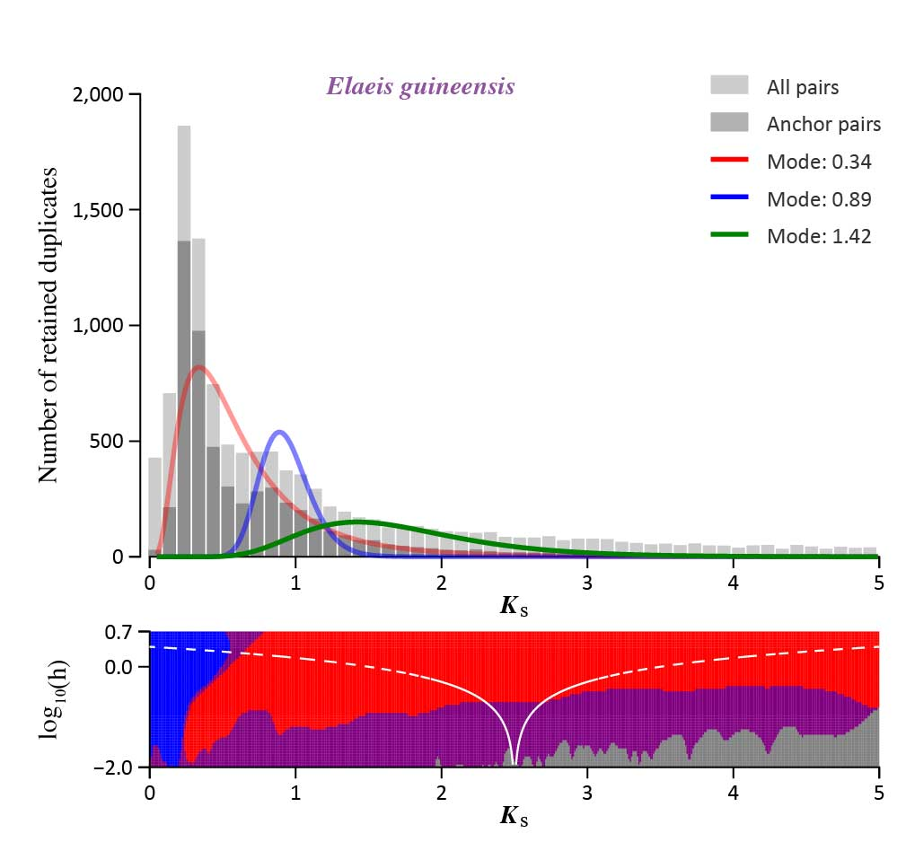
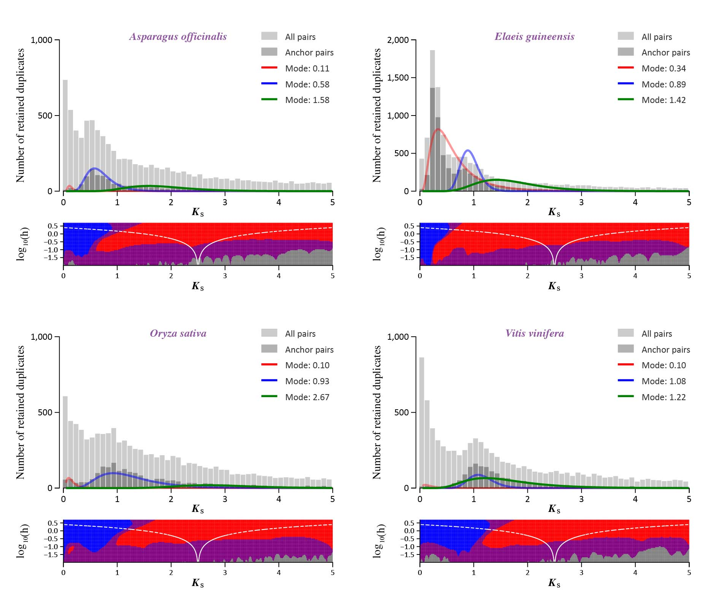
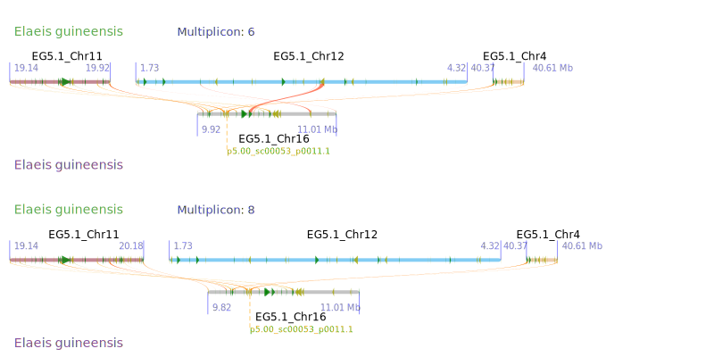
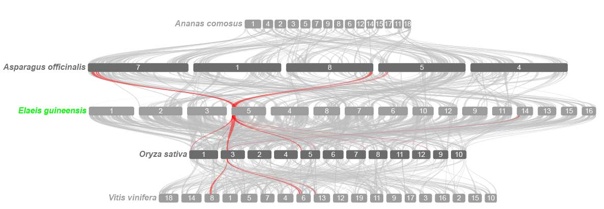

Source: https://github.com/li081766/shinyWGD/blob/main/vignettes/gallery.Rmd  

```{r, include = FALSE}
knitr::opts_chunk$set(
  collapse = TRUE,
  comment = "#>"
)
```

```{r include=FALSE}
library(fontawesome)
```

# Getting Started

This vignette provides the examples of output using 
the **`shinyWGD`** server or package.

<br></br>

# <i>K</i><sub>s</sub> Age Distribution

## Paralog <i>K</i><sub>s</sub> age distribution

 ---

### *Single species*


### *Multiple species*


 ---

### Ortholog <i>K</i><sub>s</sub> age distribution


 ---

## Raletive rate correctiong

### *With paralogous species*


### *Without paralogous species*


 ---

# Synteny Aanlysis

 ---
 
## Intra-comparing alignment

### *Dot plot*


### *Parallel-line plot*


### *Micro-synteny plot*


 ---

## Inter-comparing alignment

### *Dot plot*


### *Parallel-line plot*


### *Micro-synteny plot*


 ---

## Multiple-species alignment

  
 ---

# Clustering analysis

## *Clustering plot*


## *PAR zoom-in plot*


 ---

# Tree Building

## <i>K</i><sub>s</sub> unit tree plot


## TimeTree plot


## <i>K</i><sub>s</sub> unit tree and TimeTree joint tree plot


 ---

# Gene Tree – Species Tree Reconciliation


