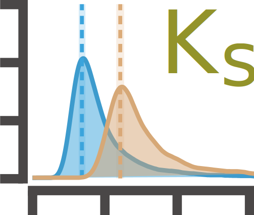
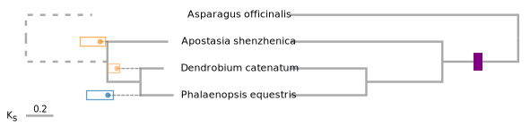
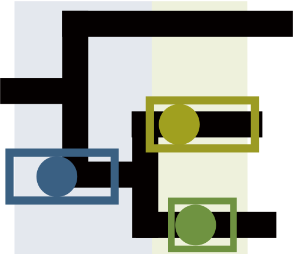
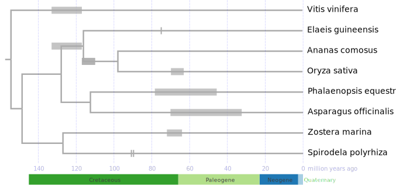

<style>
  .note-style {
    font-size: 14px;
    background-color: #DEF0FB;
    border-left: none;
    border-right: none;
    margin-bottom: 30px;
    border: 1px solid #4297D2;
    border-radius: 0 0 4px 4px;
    padding: 10px;
  }

  .note {
    width: 830px;
    font-size: 16px;
    color: white;
    background-color: #4297D2;
    padding: 5px;
    margin-top: 30px;
    border-radius: 4px 4px 0 0;
  }

  .warning-style {
    font-size: 14px;
    background-color: #FFF3C5;
    border-left: none;
    border-right: none;
    margin-bottom: 30px;
    border: 1px solid #FEDC57;
    border-radius: 0 0 4px 4px;
    padding: 10px;
  }

  .warning {
    width: 830px;
    font-size: 16px;
    color: black;
    background-color: #FEDC57;
    padding: 5px;
    margin-top: 30px;
    border-radius: 4px 4px 0 0;
  }
  .warning::before {
    content: "\26A0";
    padding-left: 10px;
    margin-right: 5px; 
    color: black; 
  }
</style>


Source: https://github.com/li081766/shinyWGD/blob/main/vignettes/intro_to_shinywgd.Rmd  

```{r, include=FALSE}
knitr::opts_chunk$set(
  collapse=TRUE,
  comment="#>"
)
```

```{r include=FALSE}
library(fontawesome)
```

# Getting Started

This vignette provides an introduction to WGD inference using 
the **`shinyWGD`** server or package.

**`shinyWGD`** can prepare the input and command lines for [`wgd`](https://github.com/arzwa/wgd), [`ksrates`](https://github.com/VIB-PSB/ksrates), [`i-ADHoRe`](https://www.vandepeerlab.org/?q=tools/i-adhore30), [`OrthoFinder`](https://github.com/davidemms/OrthoFinder), and [`Whale`](https://github.com/arzwa/Whale.jl/tree/master) 
and then study the whole genome duplication events (WGDs) of the interesting species.

This page provides a brief introduction to this server. 

<br></br>
<br></br>

# Installation

<!-- ## Install from CRAN

```r
install.packages("shinyWGD")
```
-->


## Install the latest development version from GitHub

```r
if (!require("devtools")) {
  install.packages("devtools")
}
devtools::install_github("li081766/shinyWGD", dependencies=TRUE, build_vignettes=TRUE)
```

<br></br>
<br></br>

# Usage

```r
library(shinyWGD)
runshinyWGD()
help(package="shinyWGD")
```

## Data Preparation

### <font color="#23B395">Preparing the input for `wgd`, `ksrates`, `i-ADHoRe` and `OrthoFinder`</font>

Please select the proper number of species you want to study in <font color="9f5000">Select Number of Species to Analyze:</font> first.

<!-- <div class="note">💡 Note</div>
<div class="note" style="color: #FFE906;">⚠️ Warning</div> 
  `r fa(name="exclamation-triangle", fill="green")`
-->


<div class="note">&nbsp;&nbsp;💡 Note</div>
<blockquote class="note-style">
If only one species is set, the core program will be set to <b>`wgd`</b>, otherwise, <b>`ksrates`</b> will be chosen.
</blockquote>

**`shinyWGD`** provides two options to upload the data in the `Data Preparation` Page.
<br></br>

#### <i>Option One</i>

Users can prepare a **Tab-Separated** file in which each row includes the data of a species. 

This option is suitable to study multiple species. 

The detailed format of this file is below: </br>

  + **`Tab-Separated file`**
  
    <div style="max-width: 800px; overflow-x: auto;">
      <table style="background-color: #FFFAF0; border-top: 1.6px solid #000; border-bottom: 1.6px solid #000;">
        <tr>
          <th style="padding: 5px; border-bottom: 1.6px solid #000;"> <i>latin name</i> </th>
          <th style="padding-left: 50px; padding: 5px; border-bottom: 1.6px solid #000;"> cds file name<sup>a</sup> </th>
          <th style="padding-left: 40px; padding: 5px; border-bottom: 1.6px solid #000;"> gff file name<sup>b</sup> (optional) </th>
        </tr>
        <tr>
          <td style="padding: 5px;"> <i>Elaeis guineensis</i> </td>
          <td style="padding-left: 50px; padding: 5px;"> elaeis.fasta </td>
          <td style="padding-left: 40px; padding: 5px;"> elaeis.gff </td>
        </tr>
        <tr>
          <td style="padding: 5px;"> <i>Oryza sativa</i> </td>
          <td style="padding-left: 50px; padding: 5px;"> aryza.fasta </td>
          <td style="padding-left: 40px; padding: 5px;"> oryza.gff3 </td>
        </tr>
        <tr>
          <td style="padding: 5px;"> <i>Asparagus officinalis</i> </td>
          <td style="padding-left: 50px; padding: 5px;"> asparagus.fasta.gz </td>
          <td style="padding-left: 40px; padding: 5px;"> </td>
        </tr>
      </table>
    </div>


    - **<sup>a</sup>** `cds` is the coding region of a gene or the portion of a gene's DNA or RNA that codes for protein. This file can be `fasta` or `gzipped-fasta`. <br>This column is **mandatory**. 
    - **<sup>b</sup>** `gff` is the format consists of one line per feature, each containing nine columns of data, plus optional track definition lines, see more [click here](https://www.ensembl.org/info/website/upload/gff3.html). <br>The file can be `gff`, `gff3`, `gzipped-gff`, or `gzipped-gff3`. <br>This column is **optional**.</br>
    - **`focal species`** is the parameter in `ksrates`, which will be set in the [`configure file`](https://ksrates.readthedocs.io/en/latest/configuration.html) of `ksrates`.

<div class="warning">Warning</div> 
<blockquote class="warning-style"> 
Do not contain the [alternative isoforms](https://en.wikipedia.org/wiki/Alternative_splicing) of each gene.

Do not contain the **`Header Row`** when preparing the table. 
</blockquote>  

<div class="note">&nbsp;&nbsp;💡 Note</div>
<blockquote class="note-style">
To ensure the successful transformation of  of annotation file, please review the **type** (the third column) and **attributes** (the ninth column) of the `GFF` file and make sure that when the **type** is equal to `mRNA`, the **attributes** column starts with **`ID=`**. 

Download the example `GFF` file of <i>`Arabidopsis thaliana`</i> from [PLAZA](https://ftp.psb.ugent.be/pub/plaza/plaza_public_dicots_05/GFF/ath/annotation.selected_transcript.exon_features.ath.gff3.gz).
</blockquote>

Now users need to upload the corresponding files in the **`Upload CDS / Annotation Files:`** field.

⚠️ Ensure that the uploaded files match the definitions in the **`Tab-Separated file`**.

After successfully uploading the **`tab-separated`** file and the **`CDS / Annotation`** files, the number of species in the file will be calculated. 

  - If only one species needed to be studied, **`shinyWGD`**
   will generate the command line for `wgd` by clicking the <font style="background-color: #548C00; color: white; padding: 2px; border-radius: 2px;">&nbsp;`r fa(name="screwdriver-wrench")` Create <i><b>wgd</b></i> Codes&nbsp;</font> in the right **`Setting`** panel. 
    
    - Users can check the codes by clicking the <font color="#ad5a5a">`r fa(name="share")` Go to <b><i>wgd</i></b> Scripts</font> button.
    
    - Then, users can click the <font style="background-color: #548C00; color: white; padding: 2px; border-radius: 2px;">&nbsp;`r fa(name="play")` Run <i><b>wgd</b></i>&nbsp;</font> button to operate `wgd` program in **`PSB computing cluster`** in `r fa(name="play")` **`Script Executing`** panel. After the results are generated, an email will be sent to the provided email address. 
    
    - ⚠️ The **`Script Executing`** panel only works on the server version of **`shinyWGD`** of **`PSB`**.
    
    - Then, users can click the <font style="background-color: #508ab2; color: white; padding: 2px; border-radius: 2px;">&nbsp;`r fa(name="download")` Download Analysis Data&nbsp;</font> button to download the prepared files and script for `wgd` program. 

  - If multiple species needed to be study, **`shinyWGD`** will generate the command line for `ksrates`. 
    
    - Two more parameters should be added.
      - [`focal species`](https://ksrates.readthedocs.io/en/latest/configuration.html) set the focal species for `ksrates`.
      - `newick tree` upload a tree file in `newick` format. The tree should contain all the species.
    
    - Then, users can click the <font style="background-color: #548C00; color: white; padding: 2px; border-radius: 2px;">&nbsp;`r fa(name="screwdriver-wrench")` Create <i><b>ksrates</b></i> Codes&nbsp;</font> button to generate the `configure file` and command line for `ksrates`.
    
    - After that, users can click the <font color="#ad5a5a">`r fa(name="share")` Go to <i><b>ksrates</b></i> Scripts</font> button to review the `configure file` and command line for `ksrates`.
    
    - Then, users can click the rest buttons to generate the scripts for `i-ADHoRe` and `OrthoFinder`.
    
    - Then, users can submit the computing to the **`PSB computing cluster`**. This also only works on the server version of **`shinyWGD`** of **`PSB`**.
    
    - Finally, users can click the <font style="background-color: #508ab2; color: white; padding: 2px; border-radius: 2px;">&nbsp;`r fa(name="download")` Download Analysis Data&nbsp;</font> button to download the prepared files and script for `ksrates`, `i-ADHoRe`, and `OrthoFinder` program. 

#### *Option Two*

This option provide users a more straightforward way to upload data.

  - After selecting the number of studied species, the corresponding uploading panels will be created. 
  
  - Three items (`latin name`, `cds fasta`, and annotation `gff`) of each species should be set or uploaded by users. 
  
  - Once more than one species needed to be analyzed, the `focal species` and `newick tree` should be defined by users.
  
  - Then users can click the <font style="background-color: #548C00; color: white; padding: 2px; border-radius: 2px;">&nbsp;`r fa(name="screwdriver-wrench")` Create <i><b>wgd</b></i> Codes&nbsp;</font> or <font style="background-color: #548C00; color: white; padding: 2px; border-radius: 2px;">&nbsp;`r fa(name="screwdriver-wrench")` Create <i><b>ksrates</b></i> Codes&nbsp;</font> button to create the codes for `wgd` or `ksrates` according to the species number.
  
  - After reviewing and downloading the necessary files, users can execute `wgd`, `ksrates`, `i-ADHoRe` or `OrthoFinder` in their local environment or submit the computing to the **`PSB computing cluster`**. 
  
<div class="warning">Warning</div> 
<blockquote class="warning-style">
**`shinyWGD`** will exclude genes with internal stop codons and genes whose lengths are not divisible by three. You can find details on the gene filtering process in the *Sequence_processing.log* file located in the **`Analysis_Date`** folder.
</blockquote>

### <font color="#23B395">Executing `wgd`, `krates`, `i-ADHoRe` or `OrthoFinder` locally</font>

After decompressing the downloaded compressed file (**`Analysis_Date.tgz`**), users will find the `bash` and `configure` files (`run_wgd.sh` / `run_ksrates.sh`, `run_paralog_ks_rest_species.sh`, `run_diamond_iadhore.sh`, `run_orthofinder.sh`). 

<div class="note">&nbsp;&nbsp;💡 Note</div>
<blockquote class="note-style">
In the first several lines of each `run_*.sh` file, we include the `#SBATCH` directive to specify the memory and thread usage. This is essential because our cluster relies on <i>SLURM</i> for workload management. Users can modify these lines to align with their specific cluster configurations. 

Our cluster also uses Environment Modules to manage software. In the script files, please comment out the `module load` commands for packages if you are not using Environment Modules. 
</blockquote>
  
Users can execute them in their local environment.  
    
- How to install `wgd` to your local environment, please read the [`wgd` document](https://github.com/arzwa/wgd).
- How to install `ksrate` to your local environment, please read the [`ksrates` document](https://ksrates.readthedocs.io/en/latest/installation.html).
- How to install `i-ADHoRe` to your local environment, please read the [`i-ADHoRe` document](https://www.vandepeerlab.org/?q=tools/i-adhore30).
- How to install `OrthoFinder` to your local environment, please read the [`OrthoFinder` document](https://github.com/davidemms/OrthoFinder).
    
    
<div class="note">&nbsp;&nbsp;💡 Note</div>
<blockquote class="note-style">
When using `i-ADHoRe` to do synteny analysis, the alignment will be produced firstly. The alignment process will use the [`diamond`](https://github.com/bbuchfink/diamond) program. So please install [`diamond`](https://github.com/bbuchfink/diamond) program first.
</blockquote>

<div class="note">&nbsp;&nbsp;💡 Note</div>
<blockquote class="note-style">
To compute the <i>K</i><sub>s</sub> value of each anchored gene pair and the <i>K</i><sub>s</sub> unit tree of studied species, the [`MAFFT`](https://mafft.cbrc.jp/alignment/software/), [`trimAl`](http://trimal.cgenomics.org/), and [`PAML`](http://abacus.gene.ucl.ac.uk/software/paml.html) will be used for aligning the proteins, obtaining the nucleotide alignment and calculating the <i>K</i><sub>s</sub> value, respectively. So please install <font color="green">[`MAFFT`](https://mafft.cbrc.jp/alignment/software/)</font>, <font color="green">[`trimAl`](http://trimal.cgenomics.org/)</font>, and <font color="green">[`PAML`](http://abacus.gene.ucl.ac.uk/software/paml.html)</font> first.
</blockquote>

##  Whale Preparation

In this page, users can use the output of `OrthoFinder` to prepare the input for `Whale`, a sophisticated package for the gene tree - species tree reconciliation analysis.

Users need to upload two inputs to operate `Whale.jl`. One is the species time tree in `Newick` format. Another is the folder which includes all `ALE` files. If users use `OrthoFinder` in **`shinyWGD`**, users can find the folder in `Orthofinder_wd`, named *OrthoFinderOutput_for_Whale.tar.gz*. Users can also follow the [instruction](https://github.com/arzwa/whaleprep/tree/master) of `Whale.jl` to prepare the `ALE` files by using the gene families built by other software.

<div class="note">&nbsp;&nbsp;💡 Note</div>
<blockquote class="note-style">
To run the `run_Whale_preparing.sh` to prepare the `ALE` inputs for `Whale`, the [`MrBayes`](https://nbisweden.github.io/MrBayes/) and [`ALE`](https://github.com/ssolo/ALE) will be operated to transform each gene family into its corresponding `ALE` file. How to install these two software, please refer to their websites.
</blockquote>

Once the tree file uploaded, users can check the topology of the tree in the right panel. Then users can add the **hypothetical WGD event** to a certain branch by clicking the branch.

<div class="warning">Warning</div> 
<blockquote class="warning-style">
Users should use <font color="green"><b>wgd</b></font> as the prefix for the name of <b>hypothetical WGD event</b> to satisfy the requirements of `Whale.jl`.
</blockquote>

 

In the above tree figure, four hypothetical WGD events are tested, named as *wgd1* and *wgd2*, respectively.

Users can review the added **hypothetical WGD event** in the **<font color='#AD1F1F'><i>Hypothetical WGDs</font> to test:</i>** panel in the left side.

Users can define the **Base Model** in the **Base Model** for **Whale** panel and set the **Chain** rounds in the **Set the <b><font color='orange'>Chain</font></b> for <b><i>Whale</b></i>** panel.

After setting all the parameters, users can create `Whale` scripts by clicking the <font style="background-color: #548C00; color: white; padding: 2px; border-radius: 2px;">`r fa(name="play")` Create <b><i>Whale</i></b> Codes</font> button. Then, users can review the scripts by clicking the <font color="#ad5a5a">`r fa(name="share")` Go to <i><b>Whale</b></i> Scripts</font> button

## `r fa(name="tree")` TimeTreeFetcher

If users don't ensure the evolutionary relationships among the studied species, **`shinyWGD`**
   provides an alternative way to generate the tree through interacting with [TimeTree.org](http://www.timetree.org/) database.

<div class="warning">Warning</div> 
<blockquote class="warning-style">
`TimeTree` database does not include all the species. If the species are not included in the `TimeTree` database, you should ensure the relationship in other ways.
</blockquote>

Please click the <font style="background-color: #548C00; color: white; padding: 2px; border-radius: 2px;">&nbsp;`r fa(name="tree")` Tree Extraction&nbsp;</font> block in the <font style="background-color: #548C00; color: white; padding: 2px; border-radius: 2px;">&nbsp;`r fa(name="code")` **`Scripts`**&nbsp;</font> to extract a tree from [TimeTree.org](http://www.timetree.org/) database.<br>

A file containing species names in each row needs to be uploaded in the **`Upload Species List File:`** field.

  + **`Species names file`**
  
    <div style="max-width: 800px; overflow-x: auto;">
      <table style="background-color: #FFFAF0; border-top: 1.6px solid #000; border-bottom: 1.6px solid #000;">
        <tr>
          <td style="padding: 5px;"> <i>Vitis vinifera</i> </td>
        </tr>
        <tr>
          <td style="padding: 5px;"> <i>Elaeis guineensis</i> </td>
        </tr>
        <tr>
          <td style="padding: 5px;"> <i>Oryza sativa</i> </td>
        </tr>
        <tr>
          <td style="padding: 5px;"> <i>Asparagus officinalis</i> </td>
        </tr>
      </table>
   </div>

After successfully obtaining the tree, users can review the tree in the right panel.

<br></br>

In the example, eight species were used to extract the tree from [TimeTree.org](http://www.timetree.org/). (A) The uploading panel allows users to upload the species information and start the extraction. (B) The tree display panel enables users to choose a proper strategy to build the tree and download the tree in two formats (`Newick` and `Nexus` format). When users choose **`As timetree.org`**, the module will create the tree as [TimeTree.org](http://www.timetree.org/) do. In [TimeTree.org](http://www.timetree.org/), they use the adjusted time to build the species divergence time tree. However, the evolutionary close species with the same adjusted divergence time led to more than two branches sharing the same ancestral node in the tree. When users choose the median time strategy, the conflict will be corrected. (C) The species information panel. The species with identical time records will be assigned to the same group. In this example, <i>Apostasia fujianica</i>, <i>Apostasia shenzhenica</i>, and <i>Neuwiedia singapureana</i> share the same time record in [TimeTree.org](http://www.timetree.org/). <i>Platanthera guangdongensis</i> and <i>Platanthera zijinensis</i> also have identical records.

##   <i>K</i><sub>s</sub>Dist

After successfully running the corresponding shell files, the necessary outputs will be saved in the **`Analysis_Date`** folder. Then users can choose the `Ks_Data_for_Visualization.tar.gz` file in the folder and upload it to the <font style="background-color: #548C00; color: white; padding: 2px; border-radius: 2px;">&nbsp; <i>K</i><sub>s</sub>Dist&nbsp;</font> page.

<div class="warning">Warning</div> 
<blockquote class="warning-style">
Users should choose the compressed file which is originated from the folder created by **`shinyWGD`** program to avoid the failure of displaying the correct file names.
</blockquote>

### <font color="#23B395">Paralogous <i>K</i><sub>s</sub> age distribution</font>

Once selecting one species from the drop-down menu of <font style="background-color: green; color: white; padding: 2px; border-radius: 2px;">&nbsp;`r fa(name="list")` Paralogous <i>K</i><sub>s</sub> &#x25BC;</font>, users can click the <font style="background-color: #C0C0C0; color: #fff; padding: 2px; border-radius: 2px;">&nbsp;Confirm analysis&nbsp;</font> to create the output panel in the right side of the page. 

After clicking the <font style="background-color: #548C00; color: white; padding: 2px; border-radius: 2px;">&nbsp;`r fa(name="play")` Start&nbsp;</font>, the paralogous <i>K</i><sub>s</sub> age distribution of the selected species will be generated. 

**`shinyWGD`** employs two methods to predict the potential peaks of the distribution. 

First, **`shinyWGD`** fits normal mixture models to the <b><i>K</i><sub>s</sub></b> data using maximum likelihood with EMMIX. **`shinyWGD`** will test one to ten components with 500 random starts. Fitted models are selected by the Bayesian Information Criterion (BIC) within **`EMMIX`**. Finally, the fitted models can be drawn above the bar plot of each species. Users can choose one or several peaks to draw the curve.

Second, **`shinyWGD`** uses **`SiZer`** to identify significant peaks based on the significant zero crossings of derivatives from kernel density estimation. Then, a subplot to show the output of **`SiZer`** will be added under the bar plot.

<div class="note">&nbsp;&nbsp;📚 Reference</div>
<blockquote class="note-style">
Please refer to the papers below to see details about **`EMMIX`** and **`SiZer`**.
  
  - McLachlan G, Peel D. (1999) <i>The EMMIX algorithm for the fitting of normal and t-components</i>. <b>Journal of Statistical Software</b>. 4:1–14.
  - Barker, M.S., Kane, N.C., Matvienko, M., Kozik, A., Michelmore, R.W., Knapp, S.J. and Rieseberg, L.H., (2008) <i>Multiple paleopolyploidizations during the evolution of the Compositae reveal parallel patterns of duplicate gene retention after millions of years</i>. <b>Molecular biology and evolution</b>, 25(11), pp.2445-2455.
  - Chaudhuri, P. and Marron, J.S., (1999) <i>SiZer for exploration of structures in curves</i>. <b>Journal of the American Statistical Association</b>, 94(447), pp.807-823.
</blockquote>

On the right side of the plot, a table with GMM peaks information is displayed. Users can choose which peaks to be displayed by clicking the check box of each row.

The example output is below.


### <font color="#23B395">Orthologous <i>K</i><sub>s</sub> age distribution</font>

Users need to select the species from the <font color="#38B0E4"><b>Select Species to compare</b></font> of the <font style="background-color: green; color: white; padding: 2px; border-radius: 2px;">&nbsp;`r fa(name="list")` Orthologous <i>K</i><sub>s</sub> &#x25BC;&nbsp;</font> to compute the density of <i>K</i><sub>s</sub> age distribution among the selected species. 

To obtain the potential peak of the plot, **`shinyWGD`** will fit the peak by using the Epanechnikov kernel function. Then 95% confidence interval (CI) is estimated by 1000 iterations. 

On the right side of the density plot, an ultrametric tree is displayed with circles corresponding to the density plot. Users can remove comparisons of less interest by clicking the circle in the tree. A pop-up menu will appear, allowing users to delete the selected comparison.

The example output is below.


In the above figure, the dash line is the peak of a combination of the reference species and another species. The colored rectangle is the 95% CI. Users can retrieve the detail information about the density, the peaks, and the 95% CIs by hovering the mouse above the lines or rectangles.  

### <font color="#23B395">Substitution rate correction</font>

When comparing the one-to-one orthologous <i>K</i><sub>s</sub> distributions between studied species and the reference species, the different <i>K</i><sub>s</sub> peaks for the same speciation event may exist, suggesting different synonymous substitution rates among the studied species, resulting in an over- or under-estimate for the divergence between the studied species and the reference species. 

To quantify the difference in substitution rates, **`shinyWGD`** employs the relative rate tests. First, the **Newick** tree, which contains the phylogenetic relationship, will be used to ensure enough species. Then, users need to define a <b>reference species</b> and an <b>outgroup species</b> to determine a tree structure among the species which will be used in the relative rate test. Then, the <i>K</i><sub>s</sub> distance between two species is estimated by the mode of their orthologous <i>K</i><sub>s</sub> distribution. Using the <i>K</i><sub>s</sub> distance between the reference species and the studied species, the <i>K</i><sub>s</sub> distance between the outgroup species and the reference species, the <i>K</i><sub>s</sub> distance between the outgroup species and the studied species, the distances to the studied species and the reference species after their divergence are computed. Finally, orthologous <i>K</i><sub>s</sub> between the studied species and the reference species is corrected by the double of the <i>K</i><sub>s</sub> distance to the reference species, assuming that studied species has the same substitution rate as the reference species. 

The example output is below.


In the left figure, Kernel-density estimates (KDEs) of <i>K</i><sub>s</sub> distribution for one-to-one orthologues between <i>A. officinalis</i> and other three species, namely <i>A. shenzhenica</i>, <i>D. catenatum</i> and <i>P. equestris</i>. As the modes (peaks) of the KDE all represent the distances between <i>A. officinalis</i> and the compared species, the differences observed among the <i>K</i><sub>s</sub> values of the modes indicate substitution rate variations among the studied species. The segments with arrows above the KDE denote, from top to bottom, the <i>K</i><sub>s</sub> distances computed for <i>P. equestris</i> and <i>D. catenatum</i> using <i>A. shenzhenica</i> as the reference and <i>A. officinalis</i> as the outgroup. The dotted lines align with the observed modes in the KDE of the orthologous <i>K</i><sub>s</sub> distributions. The black dots on the segments represent the divergence between <i>A. shenzhenica</i> with <i>D. catenatum</i> and between <i>A. shenzhenica</i> with <i>P. equestris</i>; hence, the lengths of segments pointed to the right show the <i>K</i><sub>s</sub> accumulated in <i>A. shenzhenica</i> and <i>D. catenatum</i> / <i>P. equestris</i>, whereas the grey segments pointed to the left show the <i>K</i><sub>s</sub> distance between <i>A. officinalis</i> and the divergence of <i>A. shenzhenica</i>. The grey rectangles show the 95% confidence intervals of the <i>K</i><sub>s</sub> inferred from 200 bootstraps.

In the right figure, **`shinyWGD`** uses arrows with directions to indicate overestimation (to the right) or underestimation (to the left) of divergence events. The arrow points to the <i>K</i><sub>s</sub> values after correcting for different substitution rates. The bar and line plots are the paralogous <i>K</i><sub>s</sub> distributions of <i>A. shenzhenica</i>.

### <font color="#23B395">Phylo-<i>K</i><sub>s</sub> analysis</font>

**`shinyWGD`** uses the single-copy gene families built by *OrthoFinder* to calculate the <i>K</i><sub>s</sub> unit tree. Users can check the tree in the *Orthofinder_wd*/*ds_tree_wd* folder, named *singleCopyGene.ds_tree.newick*. Once uploading the tree file in the <font color="green"><i>K</i><sub>s</sub> Tree</font> File panel, the <i>K</i><sub>s</sub> unit tree will displayed in the right side of the page and a ultrametric tree will automatically added in the right right side of the <i>K</i><sub>s</sub> unit tree. Users can click the branch in the ultrametric tree to add the WGD events into the branch by observing the left <i>K</i><sub>s</sub> unit tree.

Users can click the text of the species name to change the color of the text.

Users can upload a file which contains the <i>K</i><sub>s</sub> peaks of each studied species to place these peaks into the <i>K</i><sub>s</sub> unit tree. This file can be created by operating <font style="background-color: green; color: white; padding: 2px; border-radius: 2px;">&nbsp;`r fa(name="list")` Paralogous <i>K</i><sub>s</sub> &#x25BC;</font> module. 

Or, users can prepare a file blow.

  + **<i>K</i><sub>s</sub> Peaks file** separated by Tab

    <div style="max-width: 800px; overflow-x: auto;">
      <table style="background-color: #FFFAF0; border-top: 1.6px solid #000; border-bottom: 1.6px solid #000;">
        <tr>
          <th style="padding: 5px; border-bottom: 1.6px solid #000;"><i>Species</i></th>
          <th style="padding-left: 40px; padding: 5px; border-bottom: 1.6px solid #000;">Peak in</th>
          <th style="padding-left: 30px; padding: 5px; border-bottom: 1.6px solid #000;">Peak</th>
          <th style="padding-left: 40px; padding: 5px; border-bottom: 1.6px solid #000;">95% Confidence Interval</th>
        </tr>
        <tr>
          <td style="padding: 5px;">Apostasia shenzhenica</td>
          <td style="padding-left: 40px; padding: 5px;">Anchor pairs</td>
          <td style="padding-left: 30px; padding: 5px;">0.97</td>
          <td style="padding-left: 40px; padding: 5px;">0.55-2.19</td>
        </tr>
        <tr>
          <td style="padding: 5px;">Dendrobium catenatum</td>
          <td style="padding-left: 40px; padding: 5px;">Anchor pairs</td>
          <td style="padding-left: 30px; padding: 5px;">0.86</td>
          <td style="padding-left: 40px; padding: 5px;">0.38-4.18</td>
        </tr>
        <tr>
          <td style="padding: 5px;">Phalaenopsis equestris</td>
          <td style="padding-left: 40px; padding: 5px;">Anchor pairs</td>
          <td style="padding-left: 30px; padding: 5px;">0.96</td>
          <td style="padding-left: 40px; padding: 5px;">0.58-1.92</td>
        </tr>
      </table>
    </div>
  <br>

  The example output is below.

  

##  Collinear Analysis

Users can choose the `Collinear_Data_for_Visualization.tar.gz` file in the **`Analysis_Date`** folder and upload it to the <font style="background-color: #548C00; color: white; padding: 2px; border-radius: 2px;">&nbsp;&nbsp; Collinear Analysis&nbsp;</font> page. Then, users can study the *intra-*, *inter-*, and *multiple-* species synteny, as well as the *clustering analysis* between two species.

### <font color="#23B395">Intra- or Inter-species alignment</font>

After selecting the studied species, users can click the <font style="background-color: #C0C0C0; color: #fff; padding: 2px; border-radius: 2px;">&nbsp;Confirm analysis&nbsp;</font> to create the setting and output panel in the right side of the page. 

Users can set the threshold for the number of anchor pairs in each multiplicon to filter out the small multiplicons which contain less anchor pairs. 

The dot plot and parallel link plot will be generated.


### <font color="#23B395">Multiplicon-level synteny</font>

Users can also search a certain gene to check the location of the gene in the multiplicon in the <font color="green">Multiplicon-level Synteny</font> panel and then plot the searched multiplicon.


### <font color="#23B395">Multiple species alignment</font>

In the multiple species alignment panel, users can define the order of species in the plot. Users can change the color of species by clicking the text of the species name. When the mouse hovers a link, the related links with this link among species can be highlighted using different colors. 


  
### <font color="#23B395">Clustering analysis</font>

**`shinyWGD`** employs the Hierarchical clustering method for constructing putative ancestral regions (PARs). The segments are identified from the outputs of `i-ADHoRe`, and the **homolog concentration scores** are calculated using `-log(p)`, where `p` is the probability of the observed number of homolog pairs as modeled by a Poisson distribution.

<div class="note">&nbsp;&nbsp;📚 Reference</div>
<blockquote class="note-style">
To read more about <b><i>homolog concentration scores</i></b>, please refer to Putnam NH, et al. (2008) <i>The amphioxus genome and the evolution of the chordate karyotype</i>. <b>Nature</b> 453:1064–1071.
</blockquote> 
  
For each segment, the array of scores against all segments in the other genome forms a unique profile. The segments are then clustered based on the similarity of these profiles (determined by **Pearson correlation coefficient r**) using the average linkage method. The default cutoff of r is 0.3. Users can change this cutoff through the sliding block. The faint yellow rectangle will highlight the significantly enriched regions (`P < 1E-10`). Then, users can zoom in each PAR through the <font color="green"><b>Putative Ancestral Regions</b></font> block.


In the example, we used 0.5 as the cutoff for **r** and 10 to filter out the segment with fewer anchor points. In total, we identified 61 PARs. 

A single PAR zooms in is below.


##  TreeRecon

In this page, users can use `Whale` to operate the gene tree - species tree reconciliation analysis.

After `Whale` is done, users can check the output in this page.

The example output is below.


<br></br>
We can judge whether the **hypothetical WGD event** is true or not based on the Bayes factor (*K*) to compare the likelihood of q = 0(H<sub>0</sub>) to the likelihood of q > 0(H<sub>1</sub>) using the Savage–Dickey density ratio.

<div class="warning">Warning</div> 
<blockquote class="warning-style">
Please Note: the log10 Bayes factor is calculated. Thus, a Bayes factor <font color='red'><b>smaller than -2</b></font> could be considered as evidence in favor of the <i>q</i> ≠ 0 model compared to the <i>q</i> = 0 mode.
</blockquote>

Besides, users should also check the **ESS** values. Generally, ESS values exceeding at least 100 is better for a good model, although short chains may be good for exploring and testing different models. If the ESS values below 100, please increase the **Chain Rounds** in the left setting panel.

Then, users can click the <font style="background-color: #548C00; color: white; padding: 2px; border-radius: 2px;">`r fa(name="sync")`</font> button to update the species tree to display the output of Whale.

The example output is below.


In the above plot, the WGD with the solid green bar is supported with retention rates significantly different from zero, while the hollow WGD bars are the ones with retention rates not different from zero.

Then users can download the plot by clicking the <font style="background-color: #5B5B00; color: white; padding: 2px; border-radius: 2px;">`r fa(name="download")`</font> button.

##  VizWGD

In this page, users can visualize the time tree of **`MCMCTree`**, or a ultrametric tree.

### <font color="#23B395">Time tree</font>

Users can upload a nexus tree withe the divergence time information. The format of the tree is the output file of *MCMCTree*, named *FigTree.tre*. Be careful with the time unit, please use the 100 million yeas as the time scale. Users can click the text of the species name to change the color or add a symbol to the species. Users can click the branch to add a WGD into the branch.

Users can upload a file which contains the WGD events of each studied species to place these WGDs into the tree.

  + **WGD Events file** separated by Tab

    <div style="max-width: 800px; overflow-x: auto;">
      <table style="background-color: #FFFAF0; border-top: 1.6px solid #000; border-bottom: 1.6px solid #000;">
        <tr>
          <th style="border-bottom: 1.6px solid #000;"><i>Species</i></th>
          <th style="padding-left: 50px; border-bottom: 1.6px solid #000;">WGD events<sup>a</sup></th>
          <th style="padding-left: 30px; border-bottom: 1.6px solid #000;">color</th>
        </tr>
        <tr>
          <td>Elaeis guineensis</td>
          <td style="padding-left: 50px;">0.75</td>
          <td style="padding-left: 30px;">#ababab</td>
        </tr>
        <tr>
          <td>Oryza_sativa</td>
          <td style="padding-left: 50px;">0.6308-0.6989,1.10-1.17</td>
          <td style="padding-left: 30px;">#ababab</td>
        </tr>
        <tr>
          <td>Phalaenopsis_equestris</td>
          <td style="padding-left: 50px;">0.4565-0.7838</td>
          <td style="padding-left: 30px;">#ababab</td>
        </tr>
        <tr>
          <td>Zostera_marina</td>
          <td style="padding-left: 50px;">0.64-0.72</td>
          <td style="padding-left: 30px;">#ababab</td>
        </tr>
        <tr>
          <td>Spirodela polyrhiza</td>
          <td style="padding-left: 50px;">0.9079,0.8964</td>
          <td style="padding-left: 30px;">#ababab</td>
        </tr>
        <tr>
          <td>Asparagus officinalis</td>
          <td style="padding-left: 50px;">0.3245-0.7013</td>
          <td style="padding-left: 30px;">#ababab</td>
        </tr>
        <tr>
          <td>Ananas comosus</td>
          <td style="padding-left: 50px;">1.10-1.17,1.17-1.33</td>
          <td style="padding-left: 30px;">#ababab</td>
        </tr>
        <tr>
          <td>Vitis vinifera</td>
          <td style="padding-left: 50px;">1.17-1.33</td>
          <td style="padding-left: 30px;">#ababab</td>
        </tr>
      </table>
    </div>

  - **<sup>a</sup>** WGD events can be a single time point or a time interval. Please use "**,**" to separate multiple WGD events within a species.
  <br>

The example output is below.



### <font color="#23B395">Ultrametric tree</font>

Users can also upload a ultrametric tree and then add the WGD events by clicking the branches manually.

The example output is below.


<br></br>
<br></br>

# Structure

- <font color="#6650C9">`r fa(name="home")` Home</font>
- <font color="#6650C9">`r fa(name="terminal")` Scripts</font>
  - <font color="orange">`r fa(name="microscope")` Data Preparation</font>
  - <font color="orange"> Whale Preparation</font>
  - <font color="orange">`r fa(name="tree")` TimeTreeFetcher</font>
- <font color="#6650C9">`r fa(name="pencil-alt")` Analysis</font>
  - <font color="orange"> <i>K</i><sub>s</sub>Dist</font>
  - <font color="orange"> Collinear</font>
  - <font color="orange"> VizWGD</font>
  - <font color="orange"> TreeRecon</font>
- <font color="#6650C9">`r fa(name="image")` Gallery</font>
- <font color="#6650C9">`r fa(name="question")` Help</font>

<br></br>
<br></br>

# Dependencies

- ## External Software
  - [`wgd`](https://github.com/arzwa/wgd)
    - Default settings
  - [`ksrates`](https://github.com/VIB-PSB/ksrates)
    - Default settings
  - [`i-ADHoRe`](https://www.vandepeerlab.org/?q=tools/i-adhore30)
    - anchor_points: 3
    - gap_size: 35
    - alignment_method: gg2
    - cluster_gap: 40
    - q_value: 0.75
    - visualizeGHM: false
    - visualizeAlignment: false
  - [`Whale`](https://github.com/arzwa/Whale.jl/tree/master)
    - parameter: Default settings
  - [`OrthoFinder`](https://github.com/davidemms/OrthoFinder)
    - Default settings
  - [`diamond`](https://github.com/bbuchfink/diamond)
    - Default settings
  - [`MAFFT`](https://mafft.cbrc.jp/alignment/software/)
    - Default settings
  - [`trimAl`](http://trimal.cgenomics.org/)
    - automated1
    - ignorestopcodon
  - [`PAML`](http://abacus.gene.ucl.ac.uk/software/paml.html)
    - Default settings
  - [`MrBayes`](https://nbisweden.github.io/MrBayes/)
    - Default settings
  - [`ALE`](https://github.com/ssolo/ALE)
    - Default settings
- ## R packages
  - `{shiny}`
  - `{shinyjs}`
  - `{shinyFiles}`
  - `{shinyBS}`
  - `{shinyWidgets}`
  - `{shinyalert}`
  - `{bslib}`
  - `{bsplus}`
  - `{htmltools}`
  - `{stringi}`
  - `{tidyverse}`
  - `{vroom}`
  - `{english}`
  - `{data.table}`
  - `{argparse}`
  - `{dplyr}`
  - `{tools}`
  - `{seqinr}`
  - `{DT}`
 
<br></br>
<br></br>

# References

 - Zwaenepoel, A., and Van de Peer, Y., (2019) <i>wgd - simple command line tools for the analysis of ancient whole genome duplications</i>. <b>Bioinformatics</b>, bty915.

 - Sensalari, C., Maere, S., and Lohaus R., (2021) <i>ksrates: positioning whole-genome duplications relative to speciation events in KS distributions</i>. <b>Bioinformatics</b>, btab602.

  - Proost, S., Fostier, J., De Witte, D., Dhoedt, B., Demeester, P., Van de Peer, Y. and Vandepoele, K., (2012) <i>i-ADHoRe 3.0—fast and sensitive detection of genomic homology in extremely large data sets</i>. <b>Nucleic acids research</b>, 40(2), pp.e11-e11.
 
  - Zwaenepoel, A., and Van de Peer, Y., (2019) <i>Inference of ancient whole-genome duplications and the evolution of gene duplication and loss rates</i>. <b>Molecular biology and evolution</b>, 36(7), 1384-1404.
 
  - Emms, D.M., and Kelly, S., (2015) <i>OrthoFinder: solving fundamental biases in whole genome comparisons dramatically improves orthogroup inference accuracy</i>. <b>Genome biology</b>, 16(1), pp.1-14.

<br></br>
<br></br>

# Session info

```{r,sessioninfo}
sessionInfo()
```

